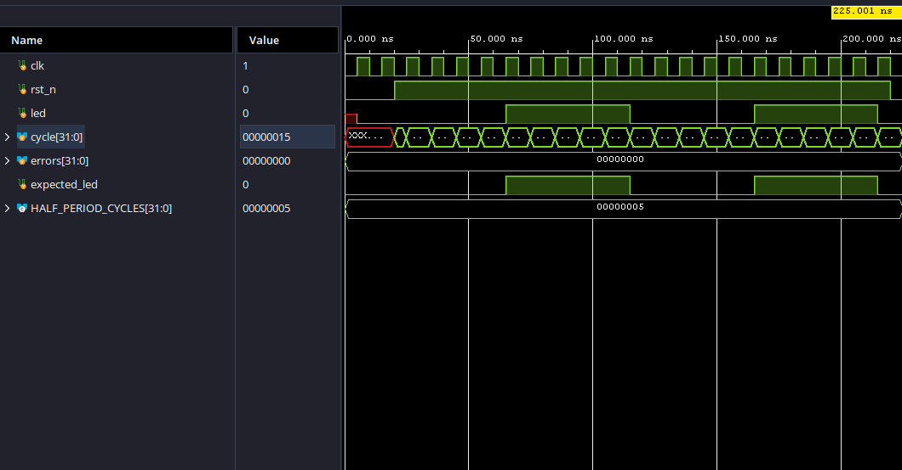

# Stage 01: Blink

## What This Stage Teaches

Vibecoded blink example to prove my board works and to get a feel for syntax.

## Design Overview

Makes the FPGA blink!

## Files

- `top.sv` — has the blink config
- `blink_tb.sv` — self-checking simulation testbench
- `blink.xdc` — Arty A7-100T constraints for this hardware stage

## Simulation

Ran a behavioral simulation using Vivado's built-in simulator. The testbench
reduces `HALF_PERIOD_CYCLES` from 50,000,000 to 5 so that LED transitions occur
quickly in simulation.

The testbench verifies that:

- The LED is off while active-low reset is asserted.
- The LED toggles after every five rising clock edges.
- Four consecutive LED transitions occur at the expected times.
- Reasserting reset clears the counter and turns the LED off.

The self-checking testbench completed with zero errors and reported `PASS`.

## Waveform

## Hardware Result

- Bitstream generation: Passed
- FPGA programming: Passed
- LED behavior: 0.5 seconds on, 0.5 seconds off
- Reset behavior: Active-low reset clears the counter and turns off the LED
- Overall result: Hardware matched simulation

## Synthesis and Timing Results

| Metric | Result |
|---|---:|
| LUTs | 8 |
| Flip-flops | 27 |
| Worst negative slack (WNS) | +5.4 ns |
| Timing met | Yes |
