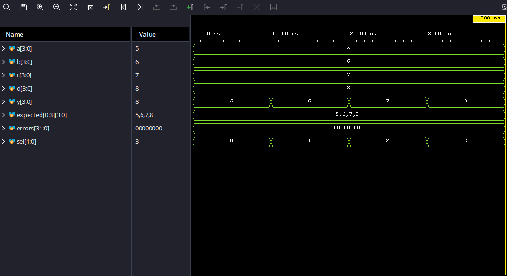

# Stage 02: 4:1 Mux

## What This Stage Teaches

What a mux is. Basically just a switch-case but done in logic gates.

## Design Overview

The mux takes 4 4-bit inputs, runs an operation on a 2 bit selector, and chooses the input that falls through. Simple, but a building block to the cpu regardless.

## Files

- `mux.sv` — has the mux config
- `mux_tb.sv` — self-checking simulation testbench
- `mux.xdc` — Arty A7-100T constraints for this hardware stage

## Simulation

Ran a behavioral simulation using Vivado's built-in simulator. The testbench
sets a, b, c, and d to 5, 6, 7, and 8 respectively. This is done instead of 1, 2, 3, 4 
in case the selector bit leaks through to the output.

The testbench verifies that:

- The mux selects inputs correctly based on selector bit.

The self-checking testbench completed with zero errors and reported `PASS`.

## Waveform

## Hardware Result

No notes. Unnecessary and nothing to prove by generating a bitstreeam.

## Synthesis and Timing Results
NOTE: Infinite WNS is fine here since there are no clock cycles, so no expected signal arrival time
| Metric | Result |
|---|---:|
| LUTs | 4 |
| Flip-flops | 0 |
| Bonded IOB | 22| 
| Worst negative slack (WNS) | inf | 
| Timing met | ? |
